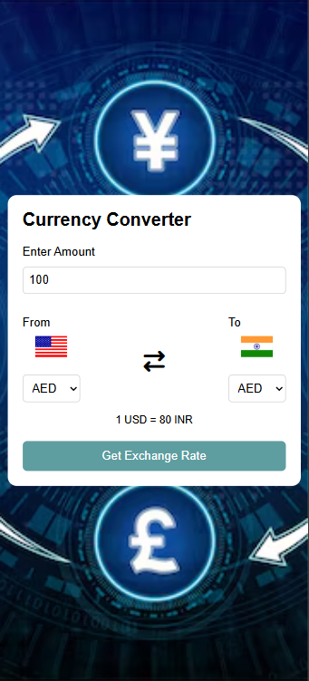

 Currency-exchange-calculator
A simple and responsive web app built with HTML, CSS, and JavaScript. It uses the Fetch API to retrieve real-time exchange rates from a currency API and allows users to convert between different currencies instantly.

 🚀 Features
- 🌐 Fetches live currency exchange rates using **Fetch API**  
- 🔄 Convert between multiple currencies  
- 🎨 Simple and responsive UI with **HTML & CSS**  
- ⚡ Instant calculation without reloading the page  
- 📱 Works on both desktop and mobile  


 🛠️ Tech Stack
- HTML5 – Structure  
- CSS3 – Styling  
- JavaScript (ES6) – Logic & Fetch API  


 📦 Installation & Usage
1. Clone the repository:
   ```bash
   git clone https://github.com/navya24shree/currency-exchange-calculator.git
2. Navigate to the project folder:

bash
Copy code
cd currency-exchange-calculator

3. Open the index.html file in your browser.


 🖥️ Desktop View
 


 📱 Mobile View
 



🔑 API Used
ExchangeRate API
https://cdn.jsdelivr.net/npm/@fawazahmed0/currency-api@latest/v1/currencies/{currencyCode}.min.json

📚 What I Learned

How to use the Fetch API to get data from external APIs

Handling JSON responses in JavaScript

DOM manipulation for updating conversion results dynamically

Building a clean and responsive UI

Live Demo:
Check out the live project here:
https://currency-exchange-calculator-zojk.vercel.app/


